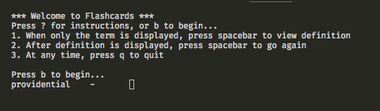

# Flashcards
This little application is a command line application designed to emulate flashcards. The application will first present a term, wait for the user input, and then present the definition of the term.

## Motivation
I wrote this application to help me study for the GRE. My biggest weakness is vocabulary, and I wanted to create a very simple application that'll read a JSON object and present me a flashcard-like experience.

## Screenshots

## Tech/framework used

<b>Built with</b>
- Golang
- macOS (not written for any other OS)

## Installation
The Makefile presents all the necessary steps to build. Run `$ make build` to build the flashcards binary. Then run `$ ./flashcards` to run the application.

You can combine those two steps by running `$ make run`.

## How to use?
Just run the application. At anytime, press 'q' to quit. Instructions are also found in the application. 
*Note: Ctrl+C does not quit the application. You must press q.*

## Contribute

PRs welcome if you want a feature or want to add more words to [terms.json](./terms.json).

## Credits
* [GetChar](https://github.com/paulrademacher/climenu/blob/a1afbb4e378bf580e7d6bddd826e44e8f64347a1/getchar.go#L6)
* [graduateshotline](https://www.graduateshotline.com/gre-word-list.html) for some extra words

## License
MIT © [Cory Thompson](./LICENSE)